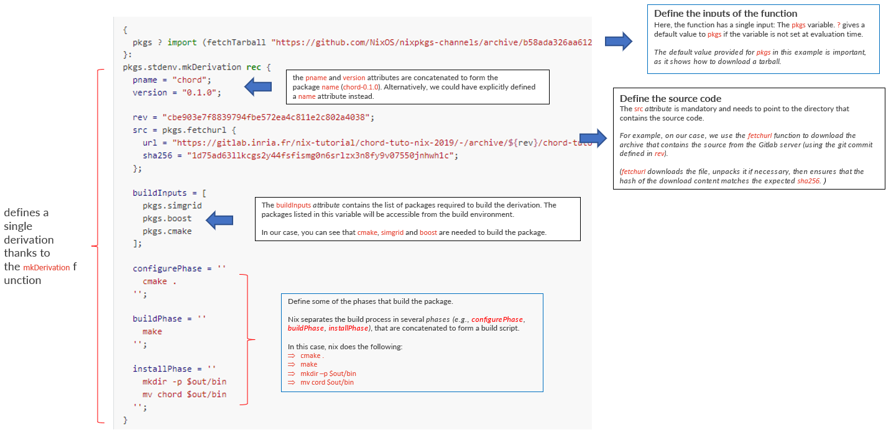
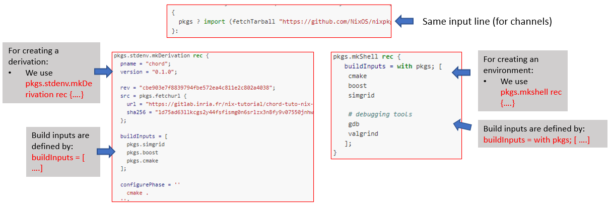

Understand the nix derivation
=====

This page records some advanced concepts and commands for **nix**

In Nix, packages are defined in a domain specific language called **Nix Expression Language** (`details <https://nixos.org/manual/nix/stable/expressions/expression-language.html>`_)

.. note::

   - **Nix derivation**: A derivation in Nix is a definition of a build, which takes some inputs and produces an output (in other words, the derivation is a function that describes a build process). 
     Using Derivation is an alternative of using a channel, and is much more reproducible as the tarball can be fixed to a specific version as it is done here. 

Nix Derivation
------
The core  for a derivation is the derivation script, an example can be accessed here

There are at least two major components in a nix build script:

- **Input** (e.g., channel for getting building tools)

- **Build process**
    - name of the package
    - where to get the package
    - building tools needed
    - build phases defination

The description for the major components in a ``.nix`` build script is described below



The file can be obtained `here <https://nix-tutorial.gitlabpages.inria.fr/nix-tutorial/_downloads/d7c5653992d2c49aca0d70d034408e2a/chord_example.nix>`_

Build the package with nix-build
*********
After download the above nix build script, we can build the package as:

.. code-block:: bash

   nix-build chord_example.nix

The output should sit in ``./result/bin``, we may be able to test the build as ``chord --help``

Build the package with nix-shell (manually)
*********
You can manually build the package by diving into the ```nix-shell``, for example

.. code-block:: bash

   nix-shell --pure chord_example.nix

The shell will create a environment for us to manually build/debug the package.

.. note::

    - with ``--pure``: the environment is clean with only tools defined in ``.nix`` (e.g., ``simgrid``, ``boost`` and ``cmake``).
    - without ``--pure``: the environment starts from the current environment variables

Now let's do the building manually,

.. code-block:: bash

    git config --global http.sslVerify false
    git clone https://gitlab.inria.fr/nix-tutorial/chord-tuto-nix-2019.git /tmp/chord-tuto-nix-2019
    cmake .
    make
    mkdir -p $out/bin
    mv chord $out/bin

Note that the reason we may have to run ``git config --global http.sslVerify false`` is that we may get ``SSL certificate problem`` from git if we don't ...

Create a generic environment with nix-shell
*********
Soemtimes we may want to have an completely isolated environment for developing or debugging a package, ``nix-shell`` can do this for us as well

Thw following shows the difference between a nix build script and a nix env script



You can download a sample env shell script from `here <https://nix-tutorial.gitlabpages.inria.fr/nix-tutorial/_downloads/d84d0fc621210e04ffeff748263d561b/shell.nix>`_

The generaic environment (or shell) can be triggered by

.. code-block:: bash

   nix-shell shell.nix