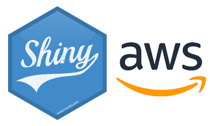

Welcome to SHINY_AWS
===================================

**SHINY_AWS** is an open-source ELT infrastructure developed by the `Ministry of Transport of New Zealand <https://www.transport.govt.nz>`_ for hosting `Shiny <https://shiny.rstudio.com/>`_ applications (or potentially any visualization & analytical interactive applications).
The purpose of the system is to better support the policy making process through intreactive code evidence. 
Some publicly-faced dashboards (using **SHINY_AWS** as the backend) include `the NZ Annual Crash Statement <https://www.mot-dev.link/acs/acs-2021/>`_ and `the NZ Annual Fleet Statistics <https://www.mot-dev.link/fleet/annual-motor-vehicle-fleet-statistics/>`_.

The codes of **SHINY_AWS** can be accessed `here <https://github.com/jzanetti/shiny_aws>`_. The system is released under the `GPLv3 license <https://www.gnu.org/licenses/gpl-3.0.en.html>`_.

.. note::

   Any questions/issues/suggestions for this system please go to **Dr. Sijin ZHANG** at zhans@transport.govt.nz

There are two suites in the repository:

- the Basic Shiny Infrastructure Suite (BSIS):
   - An EC2 instance (from spot market or on-demand)
   - Shiny application
   - Optional: an Elastic IP address
   - Optional: Authentication based on `nginx`

- the Advanced Shiny Infrastructure Suite (ASIS):
   - Autoscaling Group with EC2
   - Application Load Balancer
   - Shiny application
   - Optional: DNS using `Route 53`

The main difference between **BSIS** and **ASIS** is that **ASIS** is able to 
scale out resources (e.g., the number of CPUs) when the backend server becomes busy (e.g., suddenly there are more hits on the website), and scale in when the resources are not required.

**BSIS** is usually used for development purpose (e.g., the scaling is not a big issue, and there are existing security groups, subnets etc. that can be shared by multiple developers). 
**ASIS** is recommended for production deployment where we want a relatively isolated and scalable working environment (e.g., **ASIS** can create and manage its own permissions).

An `hello_world` example is used to demostrate the usage for this system.

The codes of **SHINY_AWS** can be accessed from `here <https://github.com/jzanetti/shiny_aws>`_

Contents
--------

.. toctree::

   Installation
   Shiny
   BSIS
   ASIS
   Utilities
   Customized_AMI
   Cookbook